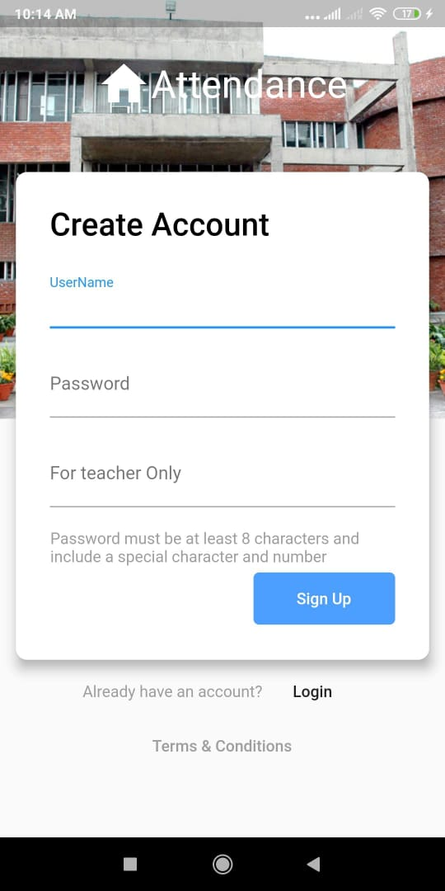
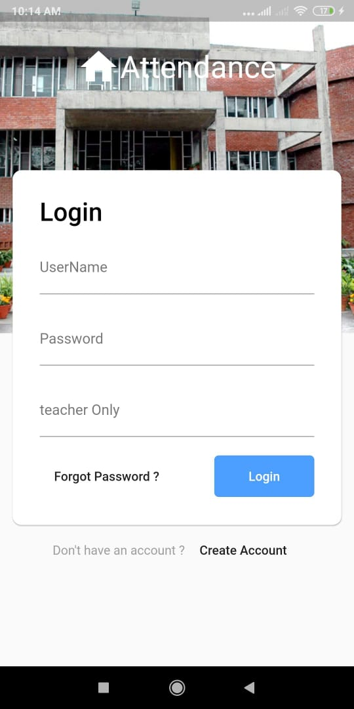

# bluetooth_app
This was built completey on [flutter](https://flutter.dev/) using [dart](https://dart.dev/) language.
I chose [firebase](https://firebase.google.com/) for database
# Say Bye Bye to pen and Paper
# Bye bye to Proxy
Many students, they don't actually present in class but ask thier friends to give proxy for the class. Though they are not present in class but thier attendace is full.
So considering this I built a flutter app which will allow teacher's to take attendace using mobile bluetooth. Its a very simple app to use and effective too.

Every Students and Teachers first have to create an account and then all those features like bluetooth automatic increment in attendance once student is connect with teacher's bluetooth device and automatic increase in total classes teacher's had taken so far are inbuilt with in this app.

You can run this app just by downloading this project and run the code in android studio or vs code.

You can get insight of this project if you want, just look at [screenshots](Screenshot) folder 

  

# Contact
Email : ashish.adhikari727@gmail.com

Github: https://github.com/ashish807
